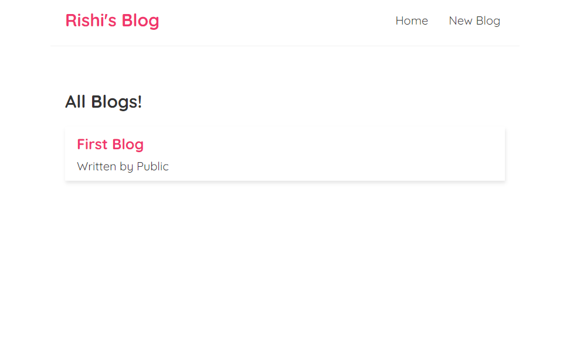
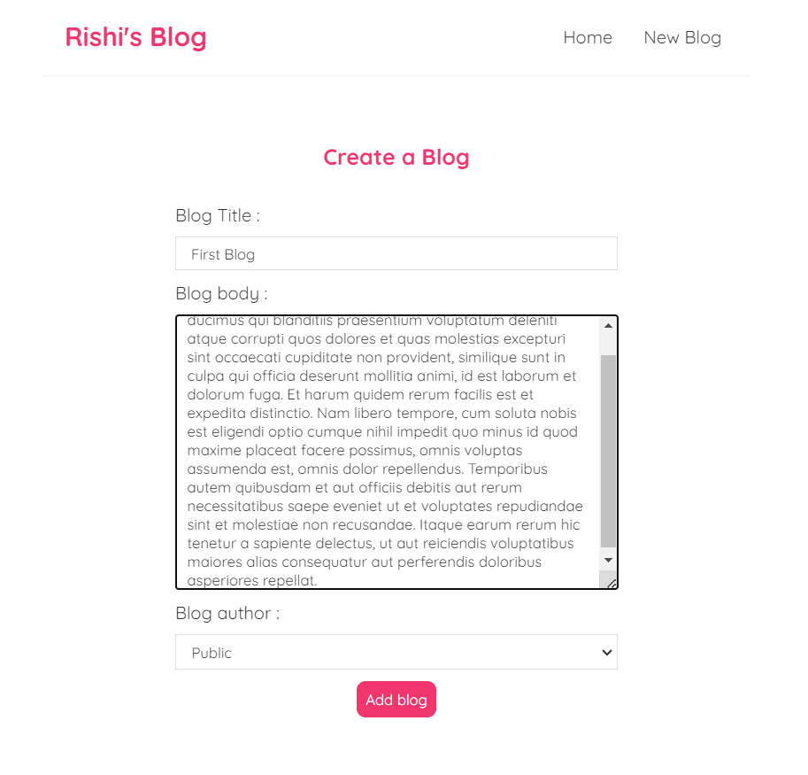

# The-Blog-Website
Created using React Js

<h1>To Run this website you need to open two terminals</h1>
 
<ul>
  <h3>To Start the Server</h3>
  <li>Run the following command in one terminal  <em>npx json-server --watch data/db.json --port 8000</em></li>
  
The JSON Server that is created here provides us with certain end points that we can use to get data. So we can send a GET HTTP Request to this end point to fetch the data.

   
  <h3>To Start the Website</h3>
  <li>Run the Following Command in the next terminal  <em>npm run start</em></li>
</ul>

<h1>Endpoints</h1>

<h1>Home Page</h1>

<h1>Create New Blog<h1>

<h1>Blogs Page<h1>

<h1>Wen You make request to some Unknown Endpoint<h1>

